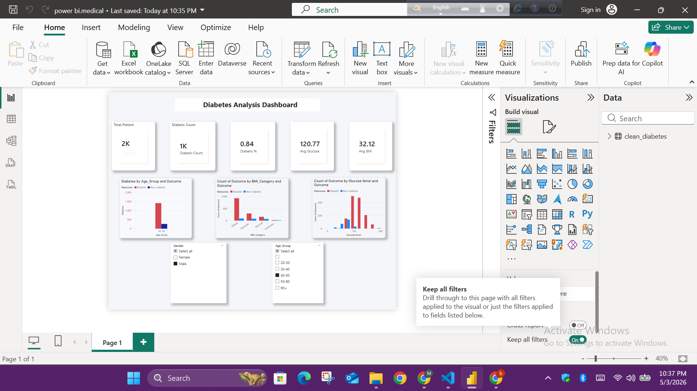

# Diabetes Analysis Dashboard

## 📊 Project Overview

This project analyzes diabetes patient data using SQL and Power BI to identify key health patterns and risk factors.

---

## 📁 Dataset

* Cleaned diabetes dataset (CSV)
* Features include:

  * Age
  * BMI
  * Glucose
  * Outcome (Diabetic / Non-diabetic)

---

## ⚙️ Tools Used

* SQL (Data Analysis)
* Power BI (Visualization)
* CSV Dataset

---

## 🧠 SQL Analysis

Basic SQL queries were used to explore:

* Total patients and diabetic count
* Age group distribution
* BMI category analysis
* Glucose level grouping
* High-risk patient identification

---

## 📈 Dashboard Features

* Age group analysis
* BMI category analysis
* Glucose distribution
* Gender filter

---

## 🔍 Key Insights

* Most diabetic patients are in the 40–50 age group
* Higher BMI is strongly linked with diabetes
* High glucose levels indicate higher diabetes risk

---

## 📸 Dashboard Preview

---

## 📌 Conclusion

This dashboard highlights important health indicators and helps in identifying high-risk diabetes patients for better decision-making.
